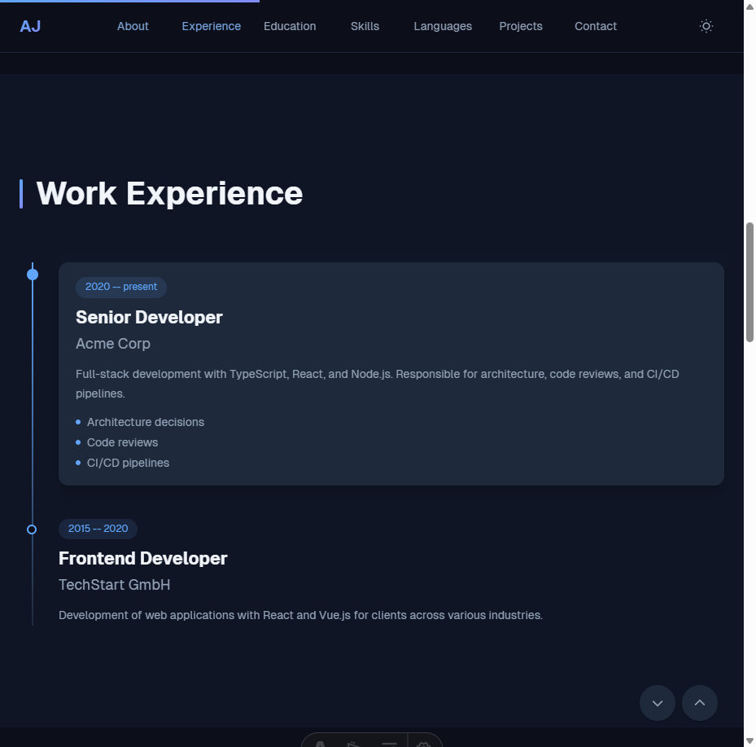
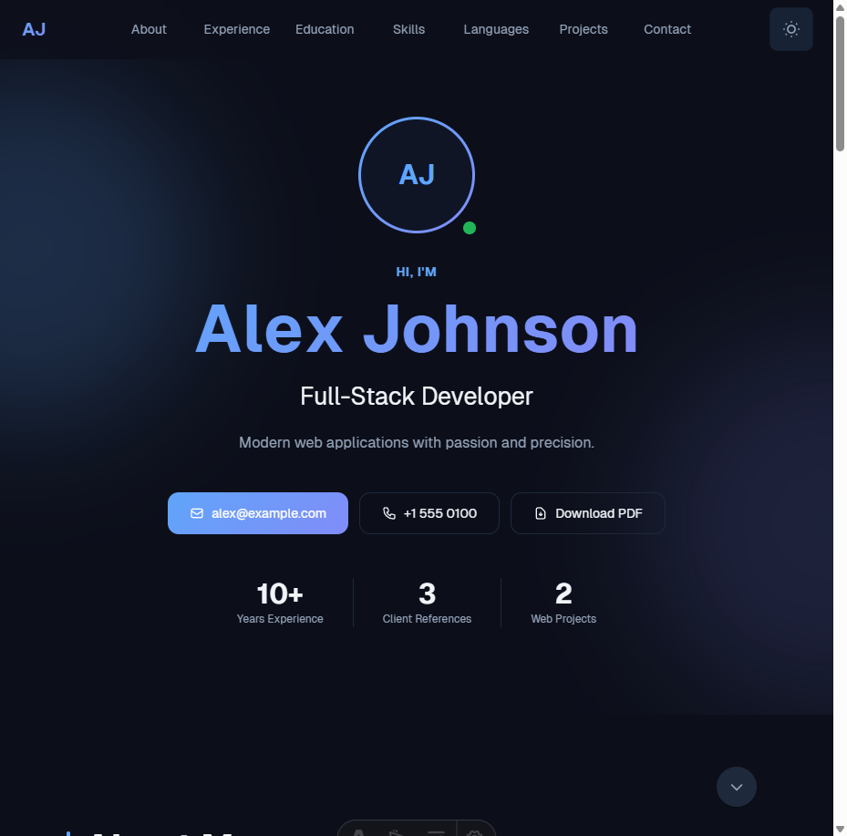

# Astro Vitae

A modern, single-page CV/resume template built with Astro, Tailwind CSS, and TypeScript. Edit one file, deploy everywhere.

[](https://astro.build/)
[](https://tailwindcss.com/)
[](https://www.typescriptlang.org/)
[](LICENSE)

**Live Demo:** [lazaridis.me](https://lazaridis.me)

---

## Preview

<p align="center">
  
</p>

<p align="center">
  
</p>

## Features

- **Single-file configuration** -- edit `src/data/cv-data.ts` and your entire CV updates
- **Full TypeScript support** with IDE autocomplete for every field
- **Dark mode** with configurable accent color and system preference detection
- **Print-optimized** -- press Ctrl+P or use the Download PDF button
- **Optional bilingual support** (EN/DE) with automatic language switcher
- **Schema.org JSON-LD** structured data for SEO
- **WCAG 2.2 AA accessible** -- keyboard navigation, ARIA labels, skip links, 44px touch targets
- **GDPR compliant** -- no cookies, no external requests, self-hosted fonts
- **Docker dev environment** included (dev + production)
- **~153 KB page weight** -- static output, no client-side framework

## Quick Start

```bash
# 1. Use this template or clone the repo
gh repo create my-cv --template GiorgoLazaridis/astro-vitae
# or
git clone https://github.com/GiorgoLazaridis/astro-vitae.git my-cv
cd my-cv

# 2. Install dependencies
npm install

# 3. Edit your CV data
#    Open src/data/cv-data.ts and replace the example content with your own.

# 4. Start the dev server
npm run dev

# 5. Deploy
npm run build
# Output is in dist/ -- deploy to any static host.
# See CUSTOMIZATION.md for deployment guides.
```

**Docker alternative:**

```bash
docker compose up
# Dev server at http://localhost:4321
```

## Tech Stack

| Technology | Version | Purpose |
|---|---|---|
| [Astro](https://astro.build/) | 5.17 | Static site generator |
| [Tailwind CSS](https://tailwindcss.com/) | 4.1 | Utility-first CSS |
| [TypeScript](https://www.typescriptlang.org/) | 5.9 | Type safety + IDE autocomplete |
| [Geist](https://vercel.com/font) | -- | Self-hosted font (Regular + Bold) |

## Project Structure

```
astro-vitae/
├── src/
│   ├── data/
│   │   ├── cv-data.ts          # Your CV content (edit this file)
│   │   └── social-icons.ts     # SVG paths for 14 social platforms
│   ├── components/
│   │   ├── Hero.astro           # Hero section with name, title, stats
│   │   ├── About.astro          # About me section
│   │   ├── Timeline.astro       # Experience + Education timeline
│   │   ├── Skills.astro         # Skills grid by category
│   │   ├── Languages.astro      # Language proficiency
│   │   ├── Portfolio.astro      # Projects showcase
│   │   ├── Contact.astro        # Contact section
│   │   ├── Nav.astro            # Navigation bar with dark mode toggle
│   │   └── LanguageSwitcher.astro
│   ├── layouts/
│   │   └── BaseLayout.astro     # HTML head, SEO, OG tags, JSON-LD
│   ├── pages/
│   │   ├── index.astro          # Main CV page
│   │   ├── 404.astro            # Error page with auto-redirect
│   │   ├── impressum.astro      # Imprint (legal)
│   │   ├── datenschutz.astro    # Privacy policy
│   │   └── [locale]/            # Bilingual route variants
│   ├── i18n/                    # Internationalization config + utilities
│   ├── styles/                  # Global CSS, tokens, animations, print
│   └── assets/                  # Static assets processed by Astro
├── public/
│   └── fonts/                   # Geist-Regular.woff2, Geist-Bold.woff2
├── Dockerfile                   # Multi-stage production build (Node + Nginx)
├── Dockerfile.dev               # Development container
├── docker-compose.yml           # Dev environment with hot reload
├── nginx.conf                   # Production Nginx config with security headers
├── astro.config.ts
├── tsconfig.json
└── package.json
```

## Customization

See **[CUSTOMIZATION.md](CUSTOMIZATION.md)** for the full configuration reference, theming guide, deployment instructions, and more.

## Available Commands

| Command | Action |
|---|---|
| `npm install` | Install dependencies |
| `npm run dev` | Start dev server at `localhost:4321` |
| `npm run build` | Build static site to `dist/` |
| `npm run preview` | Preview production build locally |

## License

This project is licensed under the [MIT License](LICENSE).

## Credits

See [CREDITS.md](CREDITS.md) for third-party licenses and attributions.
